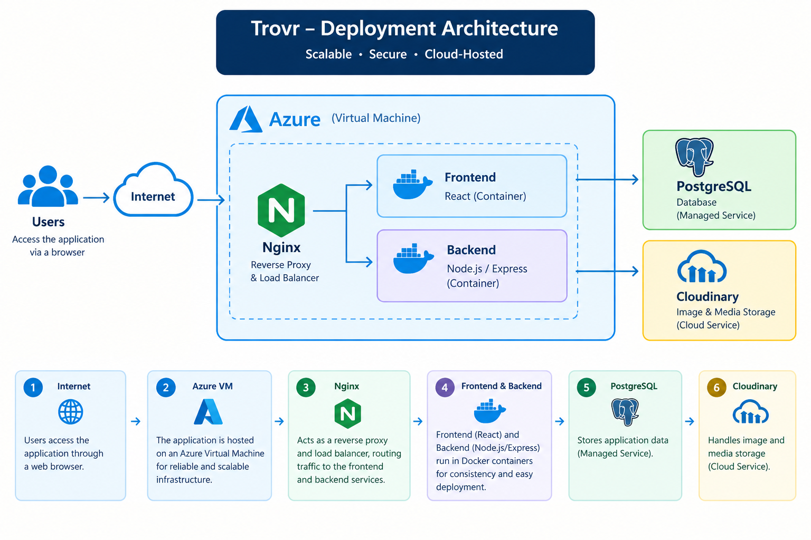

# Trovr Application — DevOps Deployment

## Project Overview

Trovr is a web application deployed in a containerized environment using Docker and Docker Compose. The application consists of a frontend, backend API, and PostgreSQL database, with Nginx serving as the reverse proxy.

As part of the DevOps team, I worked on the deployment and infrastructure side of the project, including deploying the application to an Azure Virtual Machine, managing the containerized services, configuring Nginx, and troubleshooting deployment and connectivity issues.

This repository documents the DevOps implementation, deployment process, infrastructure setup, and lessons learned from deploying the Trovr application.

## Architecture

The Trovr application follows a containerized deployment architecture hosted on an Azure Virtual Machine.

The main components are:

Azure Virtual Machine — hosts the application environment.
Nginx — acts as the reverse proxy and routes incoming requests.
Frontend container — serves the application's frontend.
Backend container — runs the backend API.
PostgreSQL container — provides the application database.
Cloudinary — handles application image storage and delivery.

Architecture Diagram
                    Internet
                       │
                       ▼
                  Azure VM
                       │
                    Nginx
                       │
              ┌────────┴────────┐
              ▼                 ▼
          Frontend           Backend
                                │
                                ▼
                           PostgreSQL/Cloudinary(image hosting)

## My DevOps Responsibilities

As part of the DevOps team, my responsibilities on the Trovr project included:

* Deploying the application to an **Azure Virtual Machine**.
* Setting up and managing the application environment on the VM.
* Containerizing and running application services using **Docker and Docker Compose**.
* Managing the frontend, backend, and PostgreSQL containers.
* Configuring **Nginx** as a reverse proxy for the application.
* Supporting the deployment of the frontend and backend services.
* Troubleshooting container, networking, database connectivity, and Nginx configuration issues.
* Working with the development team to resolve deployment-related issues.
* Managing and working with the project's GitHub repositories as part of the deployment workflow.

## Technologies & Tools

| Category                   | Technologies / Tools   |
| -------------------------- | ---------------------- |
| Cloud                      | Microsoft Azure        |
| Containerization           | Docker, Docker Compose |
| Web Server / Reverse Proxy | Nginx                  |
| Database                   | PostgreSQL             |
| Image Storage              | Cloudinary             |
| Version Control            | Git, GitHub            |
| Operating System           | Linux                  |
| Version Control            | Git, GitHub            |
| CI/CD                      | GitHub Actions         |
| Ochesstration              | kubernetes             | 

## Project Repositories

The Trovr application was developed using separate frontend and backend repositories. I forked the project repositories to my personal GitHub account for portfolio and deployment documentation purposes.

* **Frontend Repository:**
  (https://github.com/ConclaseAcademy/Trovr-Project.git)

* **Backend Repository:**
  (https://github.com/ConclaseAcademy/Trovr-backend.git)

This repository focuses specifically on the **DevOps, deployment, infrastructure, and operational aspects** of the application.

## Deployment Process

The Trovr application was deployed to an Azure Virtual Machine using a containerized architecture.

The general deployment workflow was:

1. Provision and access the **Azure Virtual Machine**.
2. Prepare the Linux environment required for deployment.
3. Configure the application services and required environment variables.
4. Build and start the application containers using **Docker Compose**.
5. Configure **Nginx** to route incoming requests to the appropriate application services.
6. Verify communication between the frontend, backend, and PostgreSQL services.
7. Test the deployed application and troubleshoot any infrastructure or connectivity issues.
8. Use **GitHub Actions** for the project's CI/CD workflow.
9. Use **Terraform** for infrastructure provisioning and **Kubernetes** for container orchestration where applicable to the project environment.

## Docker

The application uses multiple containers to separate its services.

The containerized environment includes:

* Frontend
* Backend
* PostgreSQL
* Nginx

Docker Compose is used to manage the services and their relationships.

## Nginx Configuration

Nginx was used as a reverse proxy to provide a single entry point for the deployed application and route requests to the appropriate container.

The configuration handled traffic between the external requests and the application services running within the Docker environment.

The deployment architecture was structured so that:

* Requests from users reached the **Nginx container**.
* Nginx routed frontend requests to the **Frontend container**.
* API requests were routed to the **Backend container**.
* The Backend communicated with the **PostgreSQL container** through the Docker network.

This setup allowed the application services to remain separated while Nginx managed incoming application traffic.

## Troubleshooting & Problem Solving

During the deployment process, several infrastructure and container-related issues were encountered and investigated.

### Nginx Upstream Resolution

Nginx initially experienced difficulty resolving the frontend container as an upstream service.

**Issue:**
host not found in upstream "frontend"

The issue was investigated by reviewing the Docker network configuration, service definitions, container names, and Nginx upstream configuration.

### Backend–PostgreSQL Connectivity

The backend also experienced intermittent connectivity issues when attempting to resolve the PostgreSQL service.

**Issue:**

SequelizeConnectionError: getaddrinfo EAI_AGAIN postgres_db

The problem was investigated by checking Docker Compose service configuration, container networking, and PostgreSQL service availability.

### Port Conflicts

Port-binding conflicts were also encountered during deployment. These were investigated by checking running containers and identifying services already using the required ports.

These troubleshooting activities provided practical experience with **Docker networking, service discovery, container dependencies, Nginx configuration, and Linux-based application deployment**.

## Screenshots

Screenshots demonstrating the deployment and infrastructure will be added to the `screenshots` directory.

## Key Learning Outcomes

This project provided practical experience with:

* Cloud-based application deployment
* Linux server environments
* Docker containerization
* Docker Compose
* Nginx
* Application infrastructure
* Working with multiple application services
* Deployment troubleshooting
* Git and GitHub workflows

